# EEM_Final_Cheat_Sheet

Verbatim OOXML text extraction, not a generated summary. Paragraph numbers include table cells and empty paragraphs. No page numbers are inferred.

[Open unchanged Word original](../raw/EEM_Final_Cheat_Sheet.docx)

Images below are preserved for visual checking. Their contents are not indexed or supplied to the text model.

### Paragraph 1

```text
EEM Final Exam Cheat Sheet   | Competitive Markets · Monopoly · Auctions · Futures · Hedging · Storage · Regulation · LCOE · Electricity · Externalities · Cap-and-Trade
```

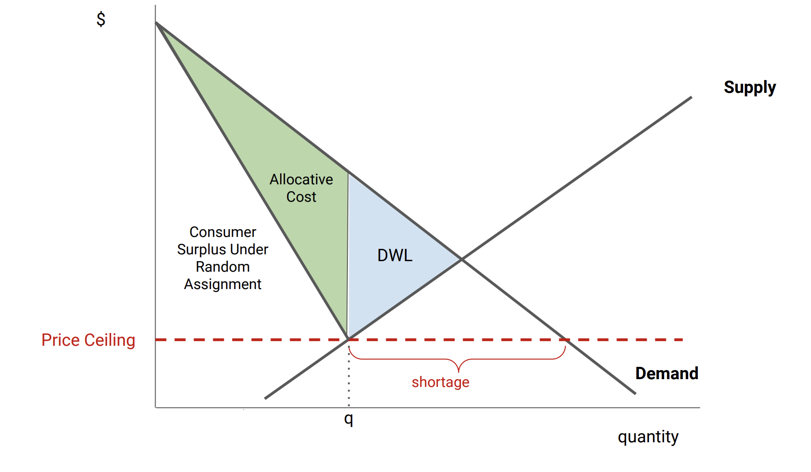

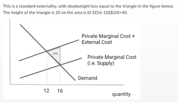

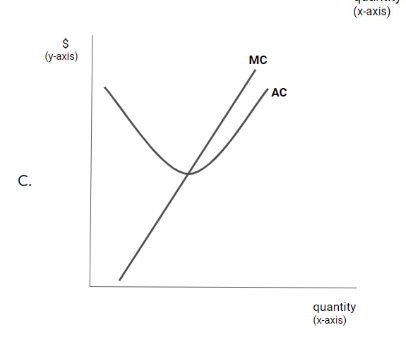

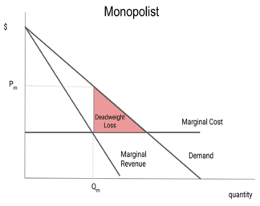

### Paragraph 2 · table cell

```text
1. Competitive Markets & Market Power
```

### Paragraph 3 · table cell

```text
Short run: Capital fixed; P from supply/demand; price volatility ≠ market power
```

### Paragraph 4 · table cell

```text
Long run: Entry/exit until P = MC = ATC (efficient)
```

### Paragraph 5 · table cell

```text
Market power: Ability to raise P by restricting Q. Non-competitive firm reduces Q → price rises.
```

### Paragraph 6 · table cell

```text
2. Monopoly
```

### Paragraph 7 · table cell

```text
MR = MC → Q* → plug into demand for P*
```

### Paragraph 8 · table cell

```text
For linear demand P = a − bQ:
```

### Paragraph 9 · table cell

```text
MR = a − 2bQ   (twice the slope)
```

### Paragraph 10 · table cell

```text
TR = P(Q)·Q,  MR = P + P'(Q)·Q
```

### Paragraph 11 · table cell

```text
Result: Lower Q, higher P, deadweight loss vs. competitive
```

### Paragraph 12 · table cell

```text
3. Dominant Firm + Fringe
```

### Paragraph 13 · table cell

```text
Q_residual = Q_demand − Q_fringe
```

### Paragraph 14 · table cell

```text
Dominant firm is a monopolist over residual demand.
```

### Paragraph 15 · table cell

```text
Market power strongest when: 
```

### Paragraph 16 · table cell

```text
Market demand is inelastic
```

### Paragraph 17 · table cell

```text
Fringe supply is inelastic
```

### Paragraph 18 · table cell

```text
→ Residual demand is most inelastic → most pricing power
```

### Paragraph 19 · table cell

```text
4. Auctions
```

### Paragraph 20 · table cell

```text
Uniform Price Auction
```

### Paragraph 21 · table cell

```text
All winners pay the clearing price
```

### Paragraph 22 · table cell

```text
Competitive firms bid ≈ MC
```

### Paragraph 23 · table cell

```text
If demand drops unexpectedly → price falls
```

### Paragraph 24 · table cell

```text
Pay-As-Bid Auction
```

### Paragraph 25 · table cell

```text
Each winner pays their own bid
```

### Paragraph 26 · table cell

```text
Firms must forecast clearing price → bid above MC
```

### Paragraph 27 · table cell

```text
If demand drops → price stays high (bids already inflated)
```

### Paragraph 28 · table cell

```text
Winner's Curse: Common-value auctions; more bidders → more overestimation risk
```

### Paragraph 29 · table cell

```text
5. Futures vs. Forwards
```

### Paragraph 30 · table cell

```text
Feature
```

### Paragraph 31 · table cell

```text
Futures
```

### Paragraph 32 · table cell

```text
Forwards
```

### Paragraph 33 · table cell

```text
Traded
```

### Paragraph 34 · table cell

```text
Exchange
```

### Paragraph 35 · table cell

```text
OTC (private)
```

### Paragraph 36 · table cell

```text
Terms
```

### Paragraph 37 · table cell

```text
Standardized
```

### Paragraph 38 · table cell

```text
Customized
```

### Paragraph 39 · table cell

```text
Counterparty risk
```

### Paragraph 40 · table cell

```text
Low (clearinghouse)
```

### Paragraph 41 · table cell

```text
Higher
```

### Paragraph 42 · table cell

```text
Basis risk
```

### Paragraph 43 · table cell

```text
Higher
```

### Paragraph 44 · table cell

```text
Lower
```

### Paragraph 45 · table cell

```text
Liquidity
```

### Paragraph 46 · table cell

```text
High
```

### Paragraph 47 · table cell

```text
Low
```

### Paragraph 48 · table cell

```text
6. Basis Risk
```

### Paragraph 49 · table cell

```text
Basis risk: Risk that futures contract is poorly correlated with actual asset
```

### Paragraph 50 · table cell

```text
Electricity: MOST basis risk — cannot store; prices vary by hour/location
```

### Paragraph 51 · table cell

```text
Crude oil: Less basis risk — storable; prices more uniform
```

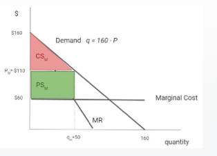

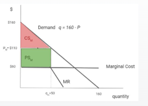

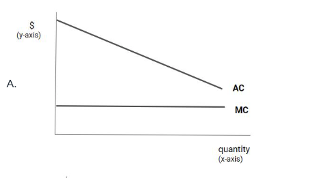

### Paragraph 52 · table cell

```text
7. Hedging
```

### Paragraph 53 · table cell

```text
Selling commodity → short futures (fear price drop)
```

### Paragraph 54 · table cell

```text
Buying commodity → long futures (fear price rise)
```

### Paragraph 55 · table cell

```text
Hedge Size = Exposure × Price Sensitivity
```

### Paragraph 56 · table cell

```text
e.g. Solar plant selling 106,000 MWh; each $1 gas drop → $5/MWh electricity drop:
```

### Paragraph 57 · table cell

```text
Hedge = 106,000 × 5 = 530,000 MMBTU (short)
```

### Paragraph 58 · table cell

```text
8. Storage Economics
```

### Paragraph 59 · table cell

```text
Carry cost = interest rate + storage cost
```

### Paragraph 60 · table cell

```text
Contango: Futures > Spot → incentive to store
```

### Paragraph 61 · table cell

```text
Backwardation: Futures < Spot → incentive to sell now
```

### Paragraph 62 · table cell

```text
Super contango: Buy spot + sell futures → lock in profit
```

### Paragraph 63 · table cell

```text
Storage reduces price volatility over time.
```

### Paragraph 64 · table cell

```text
Store if: F_T > S_0 × (1+r) + storage cost
```

### Paragraph 65 · table cell

```text
9. Transportation & Arbitrage
```

### Paragraph 66 · table cell

```text
Arbitrage if: P₂ − P₁ > MC_transport
```

### Paragraph 67 · table cell

```text
Trade equalizes prices net of transport cost.
```

### Paragraph 68 · table cell

```text
Market power in transport → price wedge too large → DWL
```

### Paragraph 69 · table cell

```text
10. Natural Monopoly
```

### Paragraph 70 · table cell

```text
AC declining over entire market demand range = Natural Monopoly
```

### Paragraph 71 · table cell

```text
MC < AC → AC falling | MC > AC → AC rising | MC = AC → AC minimum
```

### Paragraph 72 · table cell

```text
Regulatory Options
```

### Paragraph 73 · table cell

```text
P = MC: Efficient but firm loses fixed cost (profit = −F)
```

### Paragraph 74 · table cell

```text
P = AC: Profit = 0; DWL vs. efficient quantity
```

### Paragraph 75 · table cell

```text
Two-part tariff: P = MC + fixed fee ≤ CS per consumer
```

### Paragraph 76 · table cell

```text
Two-part tariff: Find CS at P=MC; that's max fixed fee.
```

### Paragraph 77 · table cell

```text
DWL = 0.5 × (P_reg − MC) × (Q_eff − Q_reg)
```

### Paragraph 78 · table cell

```text
11. Averch-Johnson Effect
```

### Paragraph 79 · table cell

```text
Rate-of-return regulation → overinvestment in capital.
```

### Paragraph 80 · table cell

```text
Allowed return > cost of capital → maximize rate base → build more infrastructure.
```

### Paragraph 81 · table cell

```text
Term
```

### Paragraph 82 · table cell

```text
Meaning
```

### Paragraph 83 · table cell

```text
Rate Base
```

### Paragraph 84 · table cell

```text
Total value of regulated capital investments
```

### Paragraph 85 · table cell

```text
Rate of Return
```

### Paragraph 86 · table cell

```text
Allowed profit on capital
```

### Paragraph 87 · table cell

```text
Cost of Capital
```

### Paragraph 88 · table cell

```text
Min. required return on investment
```

### Paragraph 89 · table cell

```text
Used & Useful
```

### Paragraph 90 · table cell

```text
Assets must be operating to enter rate base
```

### Paragraph 91 · table cell

```text
Depreciation
```

### Paragraph 92 · table cell

```text
Largest expense for regulated utilities
```

### Paragraph 93 · table cell

```text
12. Tax Incidence
```

### Paragraph 94 · table cell

```text
Less elastic side bears more of the tax.
```

### Paragraph 95 · table cell

```text
Buyer share = Supply slope / (Supply slope + |Demand slope|)
```

### Paragraph 96 · table cell

```text
Inelastic demand (insulin, gasoline) → buyers pay. Inelastic supply (land) → sellers pay.
```

### Paragraph 97 · table cell

```text
Price ceiling: Shortage + DWL + allocative inefficiency
```

### Paragraph 98 · table cell

```text
Secondary market: Fixes allocative cost but NOT DWL or shortage
```

### Paragraph 99 · table cell

```text
13. Double Marginalization
```

### Paragraph 100 · table cell

```text
Two monopolists in vertical chain each add markup → higher final P, lower Q, DWL.
```

### Paragraph 101 · table cell

```text
Requires market power at BOTH upstream and downstream levels.
```

### Paragraph 102 · table cell

```text
14. LCOE (Levelized Cost of Electricity)
```

### Paragraph 103 · table cell

```text
LCOE = constant real P/MWh that makes NPV = 0
```

### Paragraph 104 · table cell

```text
Fixed MC:
```

### Paragraph 105 · table cell

```text
LCOE = MC + Fixed Cost / Discounted MWh
```

### Paragraph 106 · table cell

```text
Variable MC:
```

### Paragraph 107 · table cell

```text
LCOE = Σ(Costs_t / (1+r)^t) / Σ(MWh_t / (1+r)^t)
```

### Paragraph 108 · table cell

```text
Higher capacity factor → lower LCOE (fixed cost spread over more MWh)
```

### Paragraph 109 · table cell

```text
Limitation: Ignores time, location, dispatchability — treats all MWh equally
```

### Paragraph 110 · table cell

```text
Compare LCOE vs. wholesale price to assess viability (market prices don't enter LCOE formula).
```

### Paragraph 111 · table cell

```text
15. Electricity Markets & Peak Pricing
```

### Paragraph 112 · table cell

```text
Merit order: Renewables → Nuclear → Coal → Gas (low to high cost)
```

### Paragraph 113 · table cell

```text
Market price = MC of marginal (most expensive) unit dispatched.
```

### Paragraph 114 · table cell

```text
Fossil fuels typically set the price.
```

### Paragraph 115 · table cell

```text
Gas Price Drop — Short Run vs. Long Run
```

### Paragraph 116 · table cell

```text
Short run: Capacity fixed; off-peak prices fall (MC ↓); peak prices unchanged (capacity-constrained)
```

### Paragraph 117 · table cell

```text
Long run: Capacity adjusts; lower build cost → more plants → peak prices fall more
```

### Paragraph 118 · table cell

```text
Build Cost Rise — Long Run
```

### Paragraph 119 · table cell

```text
Less new capacity enters → peak prices rise more than off-peak
```

### Paragraph 120 · table cell

```text
16. Externalities & Policy Instruments
```

### Paragraph 121 · table cell

```text
Private equilibrium: MB = MPC (ignores external cost)
```

### Paragraph 122 · table cell

```text
Social optimum: MB = MPC + MEC → lower Q, higher P
```

### Paragraph 123 · table cell

```text
DWL = 0.5 × (Q_market − Q_social) × MEC
```

### Paragraph 124 · table cell

```text
Pigouvian tax: Set tax = MEC → achieves Q*
```

### Paragraph 125 · table cell

```text
3 Market Failures & Solutions
```

### Paragraph 126 · table cell

```text
Unpriced externalities: Pigouvian tax
```

### Paragraph 127 · table cell

```text
Imperfect information: EnergyGuide / ENERGY STAR labels
```

### Paragraph 128 · table cell

```text
Principal-agent (landlord/tenant): Min. efficiency standards
```

### Paragraph 129 · table cell

```text
Instrument choice: Measurable emissions → Tax/Cap-and-Trade; Not measurable → Technology Mandate
```

### Paragraph 130 · table cell

```text
Policy
```

### Paragraph 131 · table cell

```text
Fixes
```

### Paragraph 132 · table cell

```text
Price
```

### Paragraph 133 · table cell

```text
Emissions
```

### Paragraph 134 · table cell

```text
Efficiency
```

### Paragraph 135 · table cell

```text
Carbon Tax
```

### Paragraph 136 · table cell

```text
Price externality
```

### Paragraph 137 · table cell

```text
Fixed
```

### Paragraph 138 · table cell

```text
Uncertain
```

### Paragraph 139 · table cell

```text
High
```

### Paragraph 140 · table cell

```text
Cap-and-Trade
```

### Paragraph 141 · table cell

```text
Quantity
```

### Paragraph 142 · table cell

```text
Uncertain
```

### Paragraph 143 · table cell

```text
Fixed
```

### Paragraph 144 · table cell

```text
High
```

### Paragraph 145 · table cell

```text
Tech Standard
```

### Paragraph 146 · table cell

```text
Technology
```

### Paragraph 147 · table cell

```text
None
```

### Paragraph 148 · table cell

```text
Fixed/Indirect
```

### Paragraph 149 · table cell

```text
Low
```

### Paragraph 150 · table cell

```text
Subsidy
```

### Paragraph 151 · table cell

```text
Incentives
```

### Paragraph 152 · table cell

```text
None
```

### Paragraph 153 · table cell

```text
Uncertain
```

### Paragraph 154 · table cell

```text
Medium
```

### Paragraph 155 · table cell

```text
Cmd & Control
```

### Paragraph 156 · table cell

```text
Quantity/Method
```

### Paragraph 157 · table cell

```text
None
```

### Paragraph 158 · table cell

```text
Fixed
```

### Paragraph 159 · table cell

```text
Low
```

### Paragraph 160 · table cell

```text
17. Cap-and-Trade & MAC Equalization
```

### Paragraph 161 · table cell

```text
At equilibrium: MAC_A = MAC_B = Permit Price P
```

### Paragraph 162 · table cell

```text
X_A + X_B = Total Abatement Required
```

### Paragraph 163 · table cell

```text
Lower-cost (flatter MAC) firm abates MORE; buys fewer permits.
```

### Paragraph 164 · table cell

```text
MAC < permit price → Abate | MAC > permit price → Buy permits
```

### Paragraph 165 · table cell

```text
Total cost = Σ(0.5 × X_i × P_i) for each firm
```

### Paragraph 166 · table cell

```text
Offsets: Increase compliance options → permit price ↓ → electricity price ↓
```

### Paragraph 167 · table cell

```text
Free permits: Opportunity cost still = market price (same as auctioned); free permits distort exit decisions
```

### Paragraph 168 · table cell

```text
18. Carbon Leakage, Reshuffling & Behavioral Failures
```

### Paragraph 169 · table cell

```text
Leakage: Regulation → production moves to less-regulated region (global emissions don't fall as much)
```

### Paragraph 170 · table cell

```text
Reshuffling: Trading partners change, but total production unchanged (no real leakage)
```

### Paragraph 171 · table cell

```text
Knowledge spillovers: Must flow to OTHER firms to be a market failure (positive externality). Internal R&D sharing is NOT a spillover.
```

### Paragraph 172 · table cell

```text
Rebound effect: Efficiency ↑ → cost per use ↓ → usage ↑ (NOT a market failure)
```

### Paragraph 173 · table cell

```text
CAFE standard: Fleet average MPG requirement; compliance via tech improvement or sales mix; credit trading allowed
```

### Paragraph 174

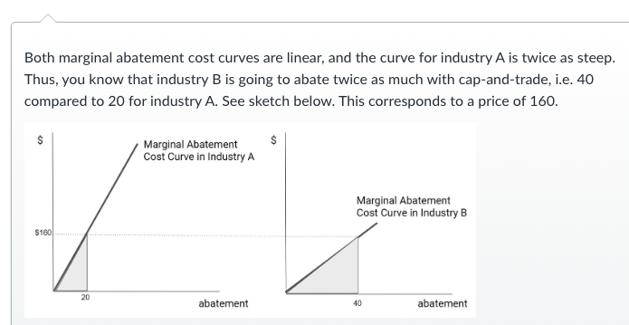

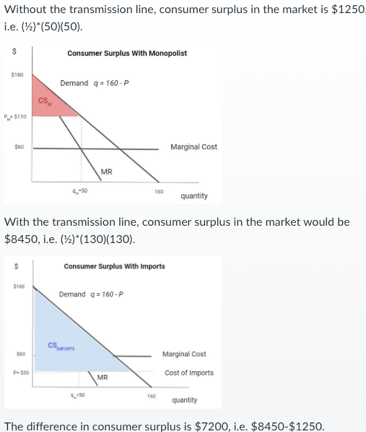

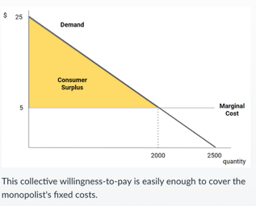

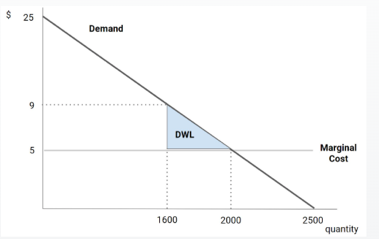

